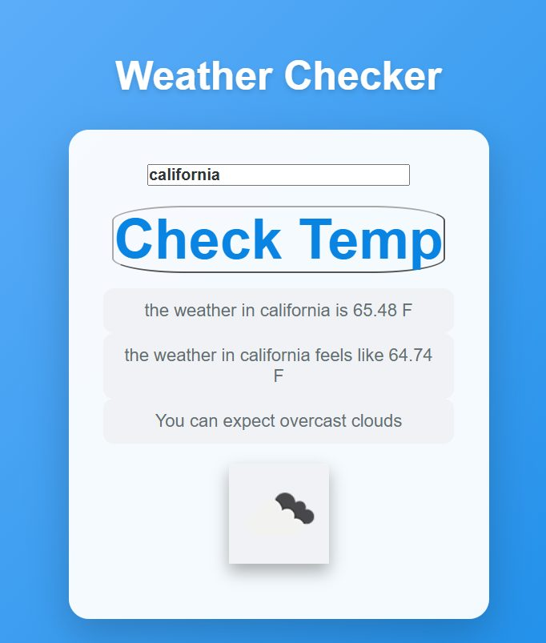

# Weather Checker

Type in a city, get the temperature in Fahrenheit, what it feels like, the conditions, and the little weather icon.

## How the code works

`checkTemp()` grabs the city name and fetches OpenWeatherMap with metric units. The API speaks Celsius, so the code converts with `data.main.temp * 9/5 + 32` and trims it to two decimals for display. Then it digs through the nested response: `main.feels_like` for the feels-like temp, `weather[0].description` for conditions, and `weather[0].icon` to build the icon image URL. Everything lands in its own div.

What I find interesting about API apps like this is how little of the work is the "app" and how much is translation. The API nests everything three levels deep and speaks metric; the user wants one flat card in Fahrenheit. The whole program is basically a reshape function with a fetch attached. The Fahrenheit conversion is one line. Finding the data took longer than the rest of the app combined. (Also, the temperature element's CSS class is `.chicken`. No reason. It just is.)

OpenWeatherMap API, plain JavaScript. My code is on the `answer` branch.
